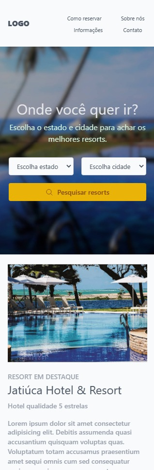

<h2>Curso gratuito Tailwind CSS Versão 2.0</h2>
<h3>Tiago Matos</h3>

Tailwind CSS é basicamente um utility-first CSS framework que prioriza a construção ultra-rápida de interfaces customizadas. 

É uma estrutura CSS de baixo nível altamente personalizável que fornece todos os blocos de construção de que você precisa para criar designs sob medida, sem nenhum estilo opinativo irritante que você precise lutar para ignorar.

<strong>Link do projeto</strong>: <a href="https://edijunior88.github.io/TailwindCSS_2_para_Iniciantes/" target="_blank">https://edijunior88.github.io/TailwindCSS_2_para_Iniciantes/</a>

<h3>Versão Desktop</h3>

 

 

<h3>Versão Mobile</h3>

 

<ul>
  <li>#1 - Introdução e instalação</li>
  <li>#2 - Fontes e cores</li>
  <li>#3 - Espaçamentos</li>
  <li>#4 - Bordas</li>
  <li>#5 - Background</li>
  <li>#6 - Largura e altura</li>
  <li>#7 - Flexbox</li>
  <li>#8 - Grid</li>
  <li>#9 - Responsividade</li>
  <li>#10 - Estados hover, focus, etc</li>
  <li>#11 - Arquivo de configuração</li>
  <li>#12 - Modo noturno</li>
  <li>#13 - Criando classes customizadas</li>
  <li>#14 - Componente Card</li>
  <li>#15 - Componente Button</li>
  <li>#16 - Componente Badge</li>
  <li>#17 - Component input</li>
  <li>#18 - Componente Dropdown</li>
  <li>#19 - Criando uma tela de login</li>
  <li>#20 - Criando uma página de hotéis 1</li>
  <li>#21 - Criando uma página de hotéis 2</li>
  <li>#22 - Criando uma página de hotéis 3</li>
  <li>#23 - Criando uma página de hotéis 4</li>
  <li>#24 - Criando uma página de hotéis 5</li>
  <li>#25 - Criando uma página de hotéis 6</li>
</ul>

<h3>Tempo Estudando a documentação</h3>

  

<h4><b>Aulas:</b> :vhs: 25 video-aulas (Total de 3hrs e 40min)</h4>
<h4><b>Status do Curso:</b>✅ Concluído</h4> 
